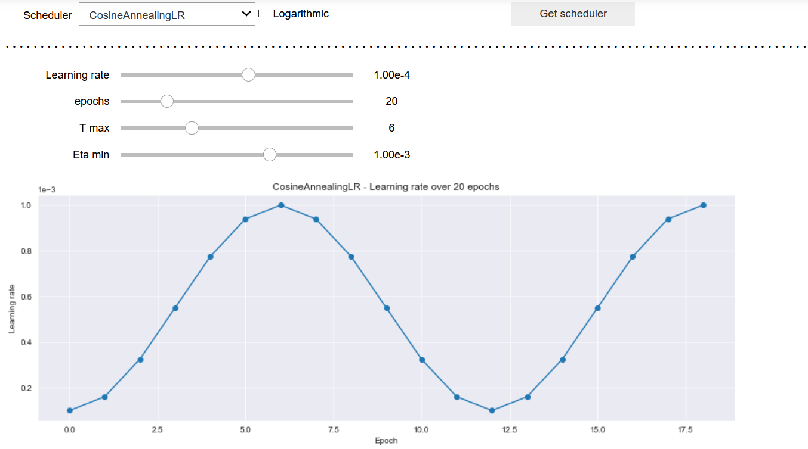

# What's the point of this repository?
I find the whole process of picking and tuning learning rate schedulers tedious and annoying. After thinking about it for a while, I came to the conclusion that most of the annoyances associated with schedulers could be alleviated with a simple GUI. I feel like a python package which runs directly in jupyter notebook would be most beneficial, since it would be cross-platform and lightweight almost by default. And since I couldn't find any proper solutions online, I decided to make my own.  

# Demo
Import the class `PLotter` and make an instance of it


```python
from schedulerplotter import Plotter
Plotter();
```



## Get scheduler
Ones you're happy with the settings just click the `Get scheduler` button and use the printed values to construct the scheduler you have created.

    optimizer = torch.optim.?(?.parameters(), lr=1.000e-04)
    torch.optim.lr_scheduler.CosineAnnealingLR(
    	optimizer,
    	eta_min = 3.200e-03,
    	T_max = 7,
    )

